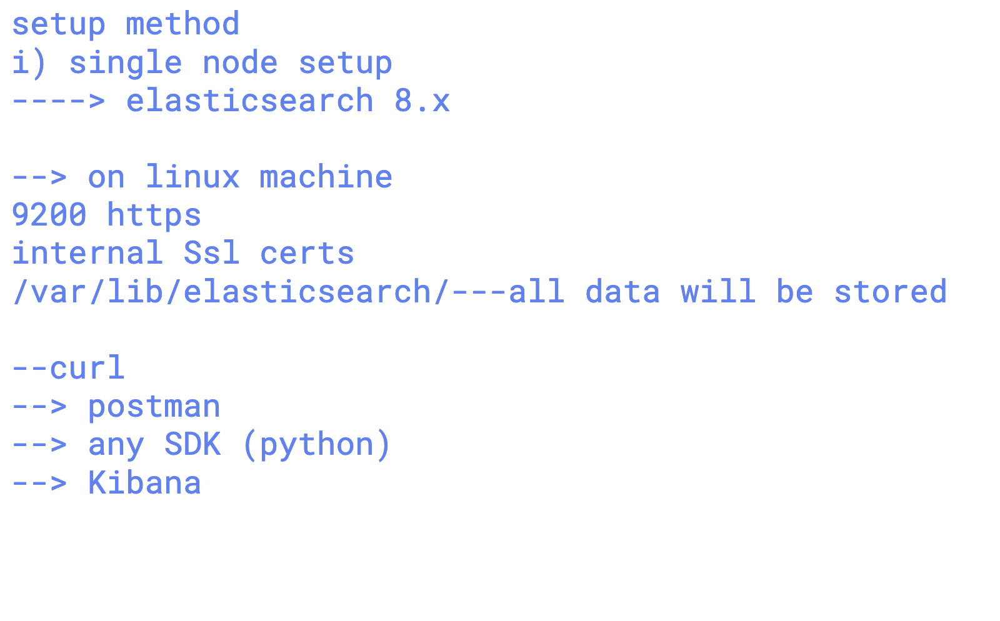
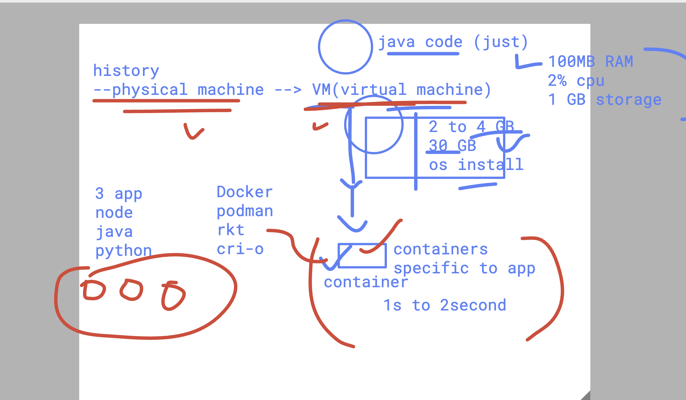
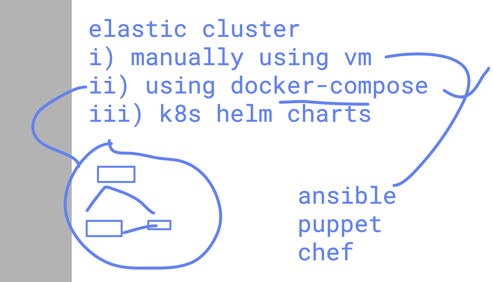

### Understanding problem with real application 

# The Problem: The "Needle in a Haystack" Dilemma

Let me paint you a picture from the early 2000s.

Imagine you're running an e-commerce website. A customer calls support: "I tried to buy a laptop 15 minutes ago, my card was charged, but I never got a confirmation email."

As the engineer on duty, where do you start?

## The old reality:

- The order data is in MySQL
- The payment logs are on Payment Server A
- The web server logs are on Web Server B
- The email service logs are on Email Server C
- The application logs are scattered across multiple files

To troubleshoot this single issue, you'd need to:

1. SSH into 4 different servers
2. grep through massive log files (grep is slow on large files)
3. Correlate timestamps manually across different timezones
4. Piece together a timeline in your head or on paper

This took hours for a single issue. Now multiply this by hundreds of servers and thousands of transactions.

### The core problems were:

- **Data silos**: Logs trapped on individual servers
- **No search capability**: Grep is primitive. Can't search across servers.
- **No correlation**: Connecting an order ID from MySQL to a log entry meant manual work
- **Scale**: Modern systems generate gigabytes of logs daily. Traditional tools couldn't handle it


### Solution using ELK stack 
### E--> elasticsearch


### info about Elasticsearch connect



## using docker to setup elasticsearch node (single node)



### Installing docker in Ubuntu 

[click here] (https://docs.docker.com/engine/install/ubuntu/)

### checking docker version 

```
buntu@ip-172-31-7-140:~$ sudo -i
root@ip-172-31-7-140:~# docker version 
Client: Docker Engine - Community
 Version:           29.3.0
 API version:       1.54
 Go version:        go1.25.7
 Git commit:        5927d80
 Built:             Thu Mar  5 14:25:48 2026
 OS/Arch:           linux/amd64
 Context:           default

Server: Docker Engine - Community
 Engine:
  Version:          29.3.0
  API version:      1.54 (minimum version 1.40)
  Go version:       go1.25.7
  Git commit:       83bca51
  Built:            Thu Mar  5 14:25:48 2026
  OS/Arch:          linux/amd64
  Experimental:     false
 containerd:
  Version:          v2.2.2
  GitCommit:        301b2dac98f15c27117da5c8af12118a041a31d9
 runc:
  Version:          1.3.4
  GitCommit:        v1.3.4-0-gd6d73eb8
 docker-init:
  Version:          0.19.0
  GitCommit:        de40ad0

```

### setup elasticsearch single node 

```
---> pulling elastic image officially 

docker pull docker.elastic.co/elasticsearch/elasticsearch:8.11.0

--> verify image pull

 docker images
                                                                                                                           i Info →   U  In Use
IMAGE                                                  ID             DISK USAGE   CONTENT SIZE   EXTRA
docker.elastic.co/elasticsearch/elasticsearch:8.11.0   4cd9ce4ccb04       2.16GB          740MB        
root@ip-172-31-7-140:~# 

--===> creating elastic instance


docker run -d \
    --name elasticsearch \
    -p 9200:9200 \
    -p 9300:9300 \
    -e "discovery.type=single-node" \
    -e "xpack.security.enabled=false" \
    docker.elastic.co/elasticsearch/elasticsearch:8.11.0


===> verify instances 

docker ps
CONTAINER ID   IMAGE                                                  COMMAND                  CREATED         STATUS         PORTS                                                                                      NAMES
eb15aead77b5   docker.elastic.co/elasticsearch/elasticsearch:8.11.0   "/bin/tini -- /usr/l…"   3 seconds ago   Up 2 seconds   0.0.0.0:9200->9200/tcp, [::]:9200->9200/tcp, 0.0.0.0:9300->9300/tcp, [::]:9300->9300/tcp   elasticsearch


```

### checking connection 

```
root@ip-172-31-7-140:~# curl http://localhost:9200
{
  "name" : "eb15aead77b5",
  "cluster_name" : "docker-cluster",
  "cluster_uuid" : "SSDbHLrqQJ6nxERdY2vctQ",
  "version" : {
    "number" : "8.11.0",
    "build_flavor" : "default",
    "build_type" : "docker",
    "build_hash" : "d9ec3fa628c7b0ba3d25692e277ba26814820b20",
    "build_date" : "2023-11-04T10:04:57.184859352Z",
    "build_snapshot" : false,
    "lucene_version" : "9.8.0",
    "minimum_wire_compatibility_version" : "7.17.0",
    "minimum_index_compatibility_version" : "7.0.0"
  },
  "tagline" : "You Know, for Search"
}
root@ip-172-31-7-140:~# curl http://localhost:9200/_cluster/health?pretty
{
  "cluster_name" : "docker-cluster",
  "status" : "green",
  "timed_out" : false,
  "number_of_nodes" : 1,
  "number_of_data_nodes" : 1,
  "active_primary_shards" : 0,
  "active_shards" : 0,
  "relocating_shards" : 0,
  "initializing_shards" : 0,
  "unassigned_shards" : 0,
  "delayed_unassigned_shards" : 0,
  "number_of_pending_tasks" : 0,
  "number_of_in_flight_fetch" : 0,
  "task_max_waiting_in_queue_millis" : 0,
  "active_shards_percent_as_number" : 100.0
}

```

### docker history for elasticsearch 

```
 92  docker run -d     --name elasticsearch     -p 9200:9200     -p 9300:9300     -e "discovery.type=single-node"     -e "xpack.security.enabled=false"     docker.elastic.co/elasticsearch/elasticsearch:8.11.0
   93  docker ps
   94  docker logs elasticsearch
   95  history 
   96  curl http://localhost:9200
   97  curl http://localhost:9200/_cluster/health?pretty
   98  history 
   99  docker ps
  100  docker stop elasticsearch
  101  docker ps 
  102  docker ps -a
  103  docker start elasticsearch
  104  docker ps 
  105  docker stop elasticsearch
```

### creating elastic cluster options 



### Installing compose 

```
108  apt  install docker-compose
  109  history 
root@ip-172-31-7-140:~# docker-compose  version 
docker-compose version 1.29.2, build unknown
docker-py version: 5.0.3
CPython version: 3.12.3
OpenSSL version: OpenSSL 3.0.13 30 Jan 2024

```

### finally running elastic cluster using docker compose 

```
131  docker-compose down 
  132  docker-compose up -d
  133  docker-compose ps
  134  history 
root@ip-172-31-7-140:~/elastic-cluster# docker-compose ps
Name              Command               State                         Ports                       
--------------------------------------------------------------------------------------------------
es01   /bin/tini -- /usr/local/bi ...   Up      0.0.0.0:9200->9200/tcp,:::9200->9200/tcp, 9300/tcp
es02   /bin/tini -- /usr/local/bi ...   Up      9200/tcp, 9300/tcp                                
es03   /bin/tini -- /usr/local/bi ...   Up      9200/tcp, 9300/tcp                                
root@ip-172-31-7-140:~/elastic-cluster# 
root@ip-172-31-7-140:~/elastic-cluster# docker-compose ps
Name              Command               State                         Ports                       
--------------------------------------------------------------------------------------------------
es01   /bin/tini -- /usr/local/bi ...   Up      0.0.0.0:9200->9200/tcp,:::9200->9200/tcp, 9300/tcp
es02   /bin/tini -- /usr/local/bi ...   Up      9200/tcp, 9300/tcp                                
es03   /bin/tini -- /usr/local/bi ...   Up      9200/tcp, 9300/tcp                                
root@ip-172-31-7-140:~/elastic-cluster# 
root@ip-172-31-7-140:~/elastic-cluster# curl http://localhost:9200/_cluster/health?pretty 
{
  "cluster_name" : "demo-cluster",
  "status" : "green",
  "timed_out" : false,
  "number_of_nodes" : 3,
  "number_of_data_nodes" : 3,
  "active_primary_shards" : 0,
  "active_shards" : 0,
  "relocating_shards" : 0,
  "initializing_shards" : 0,
  "unassigned_shards" : 0,
  "delayed_unassigned_shards" : 0,
  "number_of_pending_tasks" : 0,
  "number_of_in_flight_fetch" : 0,
  "task_max_waiting_in_queue_millis" : 0,
  "active_shards_percent_as_number" : 100.0
}
root@ip-172-31-7-140:~/elastic-cluster# curl http://localhost:9200/_cat/nodes?v 
ip         heap.percent ram.percent cpu load_1m load_5m load_15m node.role   master name
172.18.0.4           27          96  34    2.34    1.37     0.65 cdfhilmrstw -      es02
172.18.0.2           38          96  41    2.34    1.37     0.65 cdfhilmrstw *      es03
172.18.0.3           29          96  38    2.34    1.37     0.65 cdfhilmrstw -      es01

```