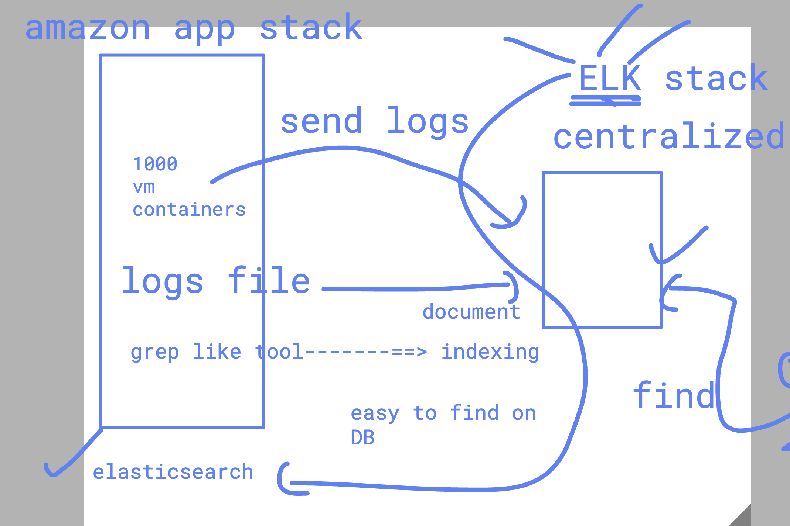

### Understanding problem with real application 

# The Problem: The "Needle in a Haystack" Dilemma

Let me paint you a picture from the early 2000s.

Imagine you're running an e-commerce website. A customer calls support: "I tried to buy a laptop 15 minutes ago, my card was charged, but I never got a confirmation email."

As the engineer on duty, where do you start?

## The old reality:

- The order data is in MySQL
- The payment logs are on Payment Server A
- The web server logs are on Web Server B
- The email service logs are on Email Server C
- The application logs are scattered across multiple files

To troubleshoot this single issue, you'd need to:

1. SSH into 4 different servers
2. grep through massive log files (grep is slow on large files)
3. Correlate timestamps manually across different timezones
4. Piece together a timeline in your head or on paper

This took hours for a single issue. Now multiply this by hundreds of servers and thousands of transactions.

### The core problems were:

- **Data silos**: Logs trapped on individual servers
- **No search capability**: Grep is primitive. Can't search across servers.
- **No correlation**: Connecting an order ID from MySQL to a log entry meant manual work
- **Scale**: Modern systems generate gigabytes of logs daily. Traditional tools couldn't handle it

### Solution using ELK stack 
### E--> elasticsearch

