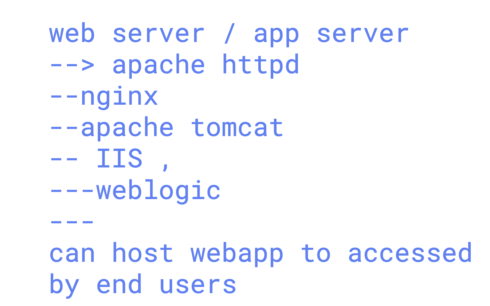

# voda_elk_16thmarch2026

## Verify Elasticsearch Process

```bash
systemctl status elasticsearch.service 
● elasticsearch.service - Elasticsearch
   Loaded: loaded (/usr/lib/systemd/system/elasticsearch.service; enabled; preset: enabled)
   Active: active (running) since Tue 2026-03-17 04:58:03 UTC; 1min 55s ago
     Docs: https://www.elastic.co
   Main PID: 522 (java)
    Tasks: 81 (limit: 9494)
   Memory: 4.4G (peak: 4.4G)
      CPU: 53.894s
   CGroup: /system.slice/elasticsearch.service
         ├─ 522 /usr/share/elasticsearch/jdk/bin/java -Xms4m -Xmx64m -XX:+UseSerialGC -Dcli.name=server -Dcli.script=/usr/share/elasticsea>
         ├─1136 /usr/share/elasticsearch/jdk/bin/java -Des.networkaddress.cache.ttl=60 -Des.networkaddress.cache.negative.ttl=10 -XX:+Alwa>
         └─1158 /usr/share/elasticsearch/modules/x-pack-ml/platform/linux-x86_64/bin/controller

Mar 17 04:57:31 ip-172-31-7-140 systemd[1]: Starting elasticsearch.service - Elasticsearch...
Mar 17 04:57:39 ip-172-31-7-140 systemd-entrypoint[522]: WARNING: Unknown module: jdk.internal.vm.ci specified to --add-exports
Mar 17 04:57:39 ip-172-31-7-140 systemd-entrypoint[522]: WARNING: Unknown module: org.elasticsearch.entitlement.instrumentationjava.logging sp>
Mar 17 04:58:03 ip-172-31-7-140 systemd[1]: Started elasticsearch.service - Elasticsearch.
root@ip-172-31-7-140:~# docker ps
CONTAINER ID   IMAGE     COMMAND   CREATED   STATUS    PORTS     NAMES
root@ip-172-31-7-140:~# ss -nlupt | grep -i 9200
tcp   LISTEN 0      4096                    *:9200            *:*    users:(("java",pid=1136,fd=571))
root@ip-172-31-7-140:~#
root@ip-172-31-7-140:~# netstat -nlpt
Active Internet connections (only servers)
Proto Recv-Q Send-Q Local Address           Foreign Address         State       PID/Program name
tcp        0      0 127.0.0.53:53           0.0.0.0:*               LISTEN      409/systemd-resolve
tcp        0      0 127.0.0.54:53           0.0.0.0:*               LISTEN      409/systemd-resolve
tcp        0      0 0.0.0.0:22              0.0.0.0:*               LISTEN      1/init
tcp6       0      0 :::9200                 :::*                    LISTEN      1136/java
tcp6       0      0 :::22                   :::*                    LISTEN      1/init
tcp6       0      0 ::1:9300                :::*                    LISTEN      1136/java
tcp6       0      0 127.0.0.1:9300          :::*                    LISTEN      1136/java
```

### Checking indexes

```bash
root@ip-172-31-7-140:~# alias elk-curl='curl  --cacert  /etc/elasticsearch/certs/http_ca.crt   -u elastic:Redhat@12345'
root@ip-172-31-7-140:~# 
root@ip-172-31-7-140:~# elk-curl  https://localhost:9200/_cat/nodes?v
ip        heap.percent ram.percent cpu load_1m load_5m load_15m node.role   master name
127.0.0.1           20          66   6    0.03    0.18     0.10 cdfhilmrstw *      ip-172-31-7-140
root@ip-172-31-7-140:~# 
root@ip-172-31-7-140:~#  elk-curl  https://localhost:9200/_cat/indices?v
health status index     uuid                   pri rep docs.count docs.deleted store.size pri.store.size dataset.size
yellow open   ashu-data 57DLlBnER86TGWQbtqh4xQ   1   1          1            0        6kb            6kb          6kb
root@ip-172-31-7-140:~# 
```

### Understanding app/web server to host any webapp



### Setting up Apache with sample webapp

```bash
apt install apache2 
systemctl status apache2
● apache2.service - The Apache HTTP Server
    Loaded: loaded (/usr/lib/systemd/system/apache2.service; enabled; preset: enabled)
    Active: active (running) since Tue 2026-03-17 05:19:29 UTC; 17s ago
      Docs: https://httpd.apache.org/docs/2.4/
   Main PID: 2385 (apache2)
     Tasks: 55 (limit: 9494)
    Memory: 5.2M (peak: 5.3M)
      CPU: 42ms
    CGroup: /system.slice/apache2.service
          ├─2385 /usr/sbin/apache2 -k start
          ├─2387 /usr/sbin/apache2 -k start
          └─2388 /usr/sbin/apache2 -k start

Mar 17 05:19:29 ip-172-31-7-140 systemd[1]: Starting apache2.service - The Apache HTTP Server...
Mar 17 05:19:29 ip-172-31-7-140 systemd[1]: Started apache2.service - The Apache HTTP Server.
root@ip-172-31-7-140:~# ls /var/www/html/
index.html
root@ip-172-31-7-140:~# git clone https://github.com/schoolofdevops/html-sample-app.git
Cloning into 'html-sample-app'...
remote: Enumerating objects: 74, done.
remote: Counting objects: 100% (3/3), done.
remote: Compressing objects: 100% (3/3), done.
remote: Total 74 (delta 0), reused 0 (delta 0), pack-reused 71 (from 1)
Receiving objects: 100% (74/74), 1.38 MiB | 5.24 MiB/s, done.
Resolving deltas: 100% (5/5), done.
root@ip-172-31-7-140:~# ls
elastic-cluster  html-sample-app  snap
root@ip-172-31-7-140:~# cp -rf html-sample-app/* /var/www/html/
root@ip-172-31-7-140:~# 
```
