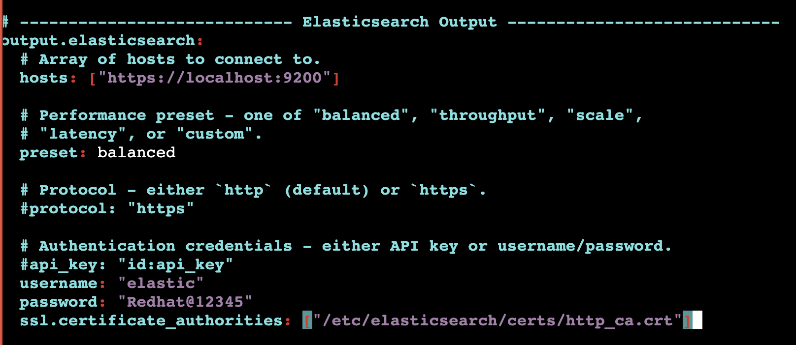

### info about 


### setup 

```
sudo apt install filebeat

===>
filebeat version 
filebeat version 8.19.12 (amd64), libbeat 8.19.12 [fcd700e2e9cd1b3f078809e74d5a989243c0c0b0 built 2026-02-24 08:42:12 +0000 UTC] (FIPS-distribution: false)

===>


filebeat version 
filebeat version 8.19.12 (amd64), libbeat 8.19.12 [fcd700e2e9cd1b3f078809e74d5a989243c0c0b0 built 2026-02-24 08:42:12 +0000 UTC] (FIPS-distribution: false)
root@ip-172-31-7-140:~# 
root@ip-172-31-7-140:~# 
root@ip-172-31-7-140:~# 
root@ip-172-31-7-140:~# cd /etc/filebeat/
root@ip-172-31-7-140:/etc/filebeat# ls
fields.yml  filebeat.reference.yml  filebeat.yml  modules.d
root@ip-172-31-7-140:/etc/filebeat# ls modules.d/
activemq.yml.disabled     cyberarkpas.yml.disabled       juniper.yml.disabled          netflow.yml.disabled     salesforce.yml.disabled
apache.yml.disabled       elasticsearch.yml.disabled     kafka.yml.disabled            nginx.yml.disabled       santa.yml.disabled
auditd.yml.disabled       envoyproxy.yml.disabled        kibana.yml.disabled           o365.yml.disabled        snyk.yml.disabled
aws.yml.disabled          fortinet.yml.disabled       

```

### listing and enabling module to read logs by filebeat 

```
root@ip-172-31-7-140:/etc/filebeat# filebeat  modules enable apache
Enabled apache
root@ip-172-31-7-140:/etc/filebeat# filebeat  modules list
Enabled:
apache

Disabled:
activemq
auditd
aws
awsfargate
azure

```
### /etc/filebeat/modules.d/apache.yml 

```
oot@ip-172-31-7-140:/etc/filebeat/modules.d# cat apache.yml 
# Module: apache
# Docs: https://www.elastic.co/guide/en/beats/filebeat/8.19/filebeat-module-apache.html

- module: apache
  # Access logs
  access:
    enabled: true

    # Set custom paths for the log files. If left empty,
    # Filebeat will choose the paths depending on your OS.
    var.paths:
     - /var/log/apache2/access.log

  # Error logs
  error:
    enabled: true

    # Set custom paths for the log files. If left empty,
    # Filebeat will choose the paths depending on your OS.
    var.paths:
     - /var/log/apache2/error.log

```

### configure elasticsearch info in filebeat yaml

```vim /etc/filebeat/filebeat.yml
```



```
200  cd /etc/filebeat/
  201  ls
  202  vim filebeat.yml 
  203  grep -in elastic filebeat.yml 
  204  vim +162 filebeat.yml 
  205  ls -l /etc/elasticsearch/certs/http_ca.crt 
  206  vim +162 filebeat.yml 

```

### more details 

```
vim +94  filebeat.yml

setup.ilm.enabled: false
setup.template.name: "apache-logs"
setup.template.pattern: "apache-logs-*"
output.elasticsearch.index: "apache-logs-%{+yyyy.MM.dd}"


====> run command 
sudo filebeat setup --index-management
sudo systemctl start filebeat
sudo systemctl status filebeat

```


### searching data in elasticsearch given by filebeat 

```
226  elk-curl  -X GET https://localhost:9200/.ds-apache*/_count?v
  227  elk-curl  -X GET https://localhost:9200/.ds-apache*/_count?pretty 
  228  elk-curl  -X GET https://localhost:9200/.ds-apache*/_search?pretty 
  229  history 
  230  elk-curl  -X GET https://localhost:9200/.ds-apache*/_search?size=1&pretty 
  231  elk-curl  -X GET "https://localhost:9200/.ds-apache*/_search?size=1&pretty" 
  232  history 
root@ip-172-31-7-140:/etc/filebeat# !225
elk-curl  -X GET https://localhost:9200/_cat/indices?v
health status index                                        uuid                   pri rep docs.count docs.deleted store.size pri.store.size dataset.size
yellow open   .ds-apache-logs-2026.03.17-2026.03.17-000001 34Kb3qlEQYWmPyoWd3j3gQ   1   1         49            0    100.8kb        100.8kb      100.8kb
yellow open   ashu-data                                    57DLlBnER86TGWQbtqh4xQ   1   1          1            0        6kb            6kb          6kb

```