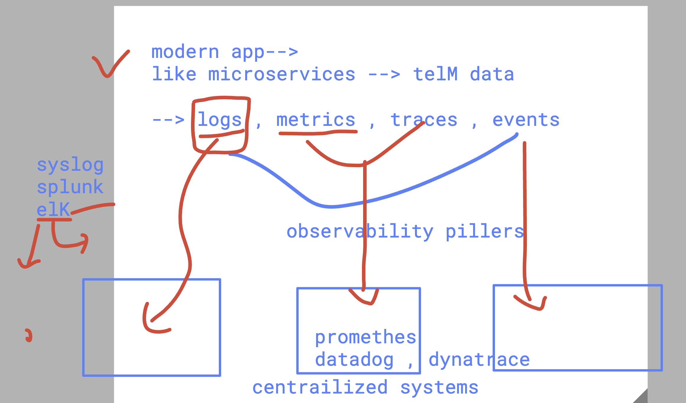
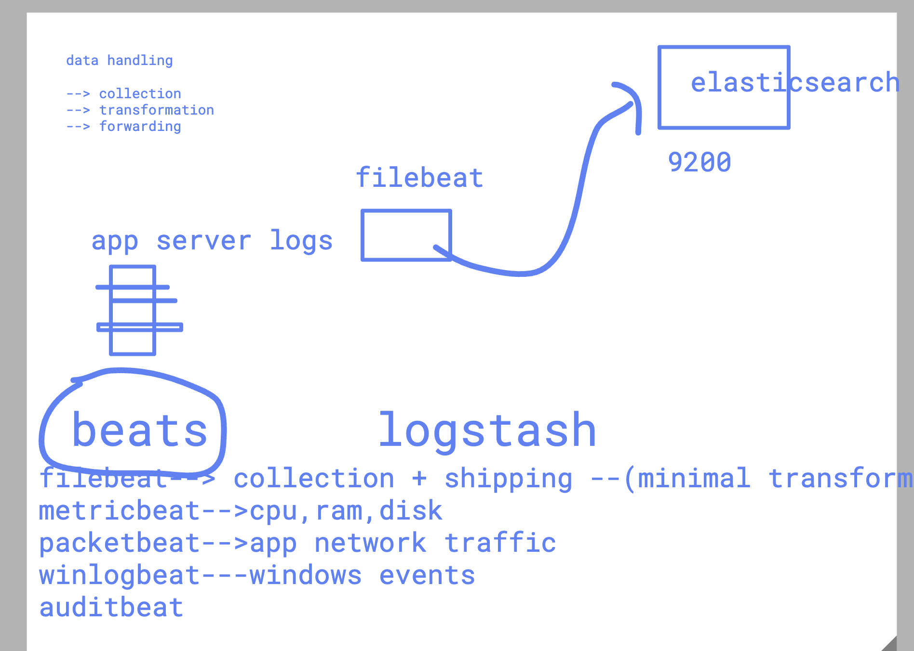

# revision 

### Observability pillers 



### beats in ELK stack 



### logstash transformation 


### changing apache config file 

```
oot@ip-172-31-7-140:~# cd /var/www/html/
root@ip-172-31-7-140:/var/www/html# ls
LICENSE.txt  README.txt  assets  elements.html  generic.html  html5up-phantom.zip  images  index.html
root@ip-172-31-7-140:/var/www/html# 
root@ip-172-31-7-140:/var/www/html# 
root@ip-172-31-7-140:/var/www/html# 
root@ip-172-31-7-140:/var/www/html# echo "Hello ashutoshh" >ashu.html 
root@ip-172-31-7-140:/var/www/html# 
root@ip-172-31-7-140:/var/www/html# 

```

### all the logs of individual apache web-server is comming to common logstash -->elasticsearch 

```
curl  -k -u elastic:Redhat@12345 "https://172.31.7.140:9200/common-log*/_search?size=100&pretty" | grep <yourname>

```